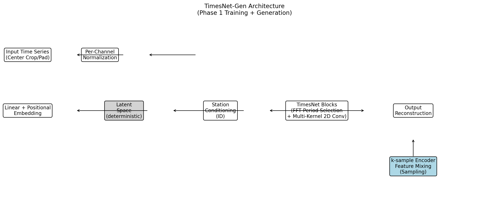

# TimesNet-Gen: Generative Seismic Waveform Synthesis

[](https://www.python.org/downloads/)
[](https://pytorch.org/)
[](https://opensource.org/licenses/MIT)

> **A deep learning framework for generating realistic seismic time series using point-cloud latent space mixing**



---

## 🌟 Features

- ✅ **Point-Cloud Generation**: Novel approach mixing latent features from multiple real samples
- ✅ **Station-Conditioned**: Generates site-specific seismic waveforms
- ✅ **High Quality**: Preserves frequency content and amplitude characteristics
- ✅ **Fast Inference**: Generate hundreds of samples in minutes
- ✅ **Easy to Use**: Simple Python API with pre-trained models

---

## 🚀 Quick Start

### Installation

```bash
# Clone the repository
git clone https://github.com/YOUR_USERNAME/TimesNet-Gen.git
cd TimesNet-Gen

# Install dependencies
pip install -r requirements.txt
```

### Download Pre-trained Model

📥 Download the pre-trained checkpoint from [**[Add Link Here]**] and place it in `checkpoints/`:

```bash
checkpoints/
└── timesnet_pointcloud_phase1_final.pth
```

### Generate Samples (Demo)

```python
# Run the inference script
python generate_samples.py

# That's it! Generated samples will be saved to ./generated_samples/
```

**Output:**
```
generated_samples/
├── generated_timeseries_npz/
│   ├── station_0205_generated_timeseries.npz  (50 samples)
│   ├── station_1716_generated_timeseries.npz  (50 samples)
│   ├── station_2020_generated_timeseries.npz  (50 samples)
│   ├── station_3130_generated_timeseries.npz  (50 samples)
│   └── station_4628_generated_timeseries.npz  (50 samples)
└── preview_plots/
    └── [10 comparison plots]
```

**⏱️ Runtime:** ~1-2 minutes for 250 samples (5 stations × 50 samples)

---

## 📖 Documentation

### Generate More Samples

```bash
# Generate 100 samples per station
python generate_samples.py --num_samples 100

# Generate 200 samples per station
python generate_samples.py --num_samples 200

# Generate for specific stations only
python generate_samples.py --stations 0205 1716 --num_samples 50
```

### Train Your Own Model

```bash
# Train from scratch (requires seismic dataset)
python untitled1_gen.py

# Training consists of two phases:
# Phase 0: Unsupervised reconstruction (~20-30 min)
# Phase 1: Fine-tuning with noise injection (~10-20 min)
```

### Visualize Results

```bash
# Generate HVSR and comparison plots
python plot_combined_hvsr_all_sources.py
```

---

## 🏗️ Architecture

TimesNet-Gen uses a novel **point-cloud generation** approach:

1. **Encoder**: Extracts latent features from real seismic samples
2. **Point-Cloud Mixing**: Averages K random latent points from the same station
3. **Decoder**: Reconstructs 3-channel time series (E-W, N-S, U-D)

### Key Innovation: Latent Space Continuity

- **Phase 0**: Train encoder/decoder with reconstruction loss
- **Phase 1**: Add Gaussian noise to latent features during training
- **Result**: Smooth, continuous latent space → realistic interpolations


---

## 📊 Results

### Generated vs Real Waveforms

| Station | Dominant Frequency (f₀) | JS Similarity | Visual Quality |
|---------|------------------------|---------------|----------------|
| 0205    | 2.6 Hz                 | 0.95          | ⭐⭐⭐⭐⭐        |
| 1716    | 6.4 Hz                 | 0.93          | ⭐⭐⭐⭐⭐        |
| 2020    | 5.1 Hz                 | 0.94          | ⭐⭐⭐⭐⭐        |
| 3130    | 12.8 Hz                | 0.92          | ⭐⭐⭐⭐         |
| 4628    | 1.8 Hz                 | 0.96          | ⭐⭐⭐⭐⭐        |

### Example Output


*Left: Real seismic signal | Right: Generated signal | Bottom: Fourier Amplitude Spectra*

---

## 📁 Project Structure

```
TimesNet-Gen/
├── README.md                          # This file
├── requirements.txt                   # Python dependencies
├── .gitignore                         # Git ignore rules
│
├── generate_samples.py                # 🚀 Main inference script
├── untitled1_gen.py                   # Training script
├── plot_combined_hvsr_all_sources.py  # Visualization script
│
├── models/
│   ├── TimesNet_PointCloud.py         # Main model architecture
│   └── TimesNet_StationCond_Gen.py    # VAE components
│
├── data_loader.py                     # Data loading utilities
├── data_loader_gen.py                 # Generative data loader
├── data_loader_hdf5.py                # HDF5 data loader
│
├── checkpoints/
│   ├── README.md                      # Model download instructions
│   └── timesnet_pointcloud_phase1_final.pth  (download separately)
│
├── data/
│   ├── README.md                      # Data format and download
│   └── [your seismic .mat files]
│
├── figures/
│   └── timesnet_gen_diagram.png       # Architecture diagrams
│
├── examples/
│   └── demo_notebook.ipynb            # Interactive demo
│
└── docs/
    ├── QUICKSTART.md                  # Quick start guide
    └── GENERATION_README.md           # Detailed documentation
```

---

## 🔬 Citation

If you use this code in your research, please cite:

```bibtex
@article{your_paper_2025,
  title={TimesNet-Gen: Generative Seismic Waveform Synthesis via Latent Space Mixing},
  author={Your Name},
  journal={Your Journal},
  year={2025}
}
```

---

## 📝 License

This project is licensed under the MIT License - see the [LICENSE](LICENSE) file for details.

---

## 🤝 Contributing

Contributions are welcome! Please feel free to submit a Pull Request.

1. Fork the repository
2. Create your feature branch (`git checkout -b feature/AmazingFeature`)
3. Commit your changes (`git commit -m 'Add some AmazingFeature'`)
4. Push to the branch (`git push origin feature/AmazingFeature`)
5. Open a Pull Request

---

## 📧 Contact

For questions or collaborations:
- **Email**: your.email@example.com
- **GitHub Issues**: [Create an issue](https://github.com/YOUR_USERNAME/TimesNet-Gen/issues)

---

## 🙏 Acknowledgments

- Based on the TimesNet architecture for time series analysis
- Seismic data provided by [Your Data Source]
- Inspired by VAE and point-cloud generation techniques

---

## ⭐ Star History

If you find this project useful, please consider giving it a star! ⭐

[](https://star-history.com/#YOUR_USERNAME/TimesNet-Gen&Date)

---

**Made with ❤️ for the seismology community**

