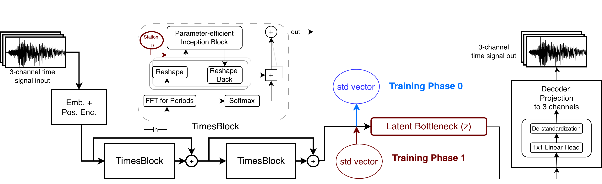
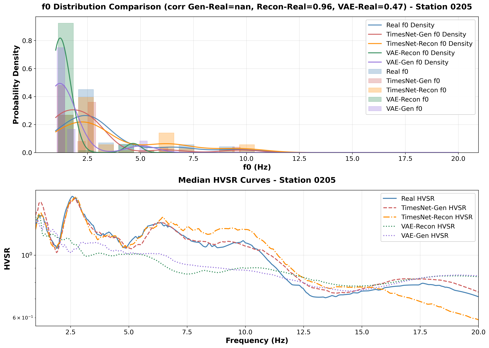
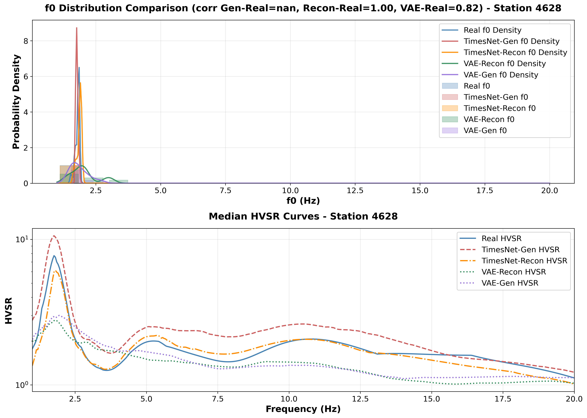

# TimesNet-Gen: Seismic Waveform Generation via Point-Cloud Aggregation

[](https://www.python.org/downloads/)
[](https://pytorch.org/)
[](https://opensource.org/licenses/MIT)

---

## 📄 Paper

**[Paper Title]**  
Authors: [Your Names]  
arXiv: [Link will be added upon publication]  
Conference/Journal: [Venue]

> **Abstract:** [Brief 2-3 sentence summary of your work]


---

## 🚀 Quick Start

### 1. Installation

```bash
git clone https://github.com/yourusername/TimesNet-Gen.git
cd TimesNet-Gen
pip install -r requirements.txt
```

### 2. Download Pre-trained Model

Download the pre-trained checkpoint and latent bank from Google Drive:

**📥 Google Drive Folder:**
[Download all files from here](https://drive.google.com/drive/folders/1ZylGGRR5CFOUjqTgFJIuNvLRHOQ5Zx0h?usp=sharing)

**Files to download:**
- `timesnet_pointcloud_phase1_final.pth` (437.9 MB) → Save to `./checkpoints/`
- `latent_bank_phase1.npz` (993.5 MB) → Save to `./checkpoints/`

**Quick Download (using `gdown`):**
```bash
pip install gdown

# Download entire folder
gdown --folder https://drive.google.com/drive/folders/1ZylGGRR5CFOUjqTgFJIuNvLRHOQ5Zx0h?usp=sharing -O checkpoints/

# Or download individual files (if you have file IDs)
# gdown --id FILE_ID -O checkpoints/timesnet_pointcloud_phase1_final.pth
# gdown --id FILE_ID -O checkpoints/latent_bank_phase1.npz
```

**Required files:**
- `./checkpoints/timesnet_pointcloud_phase1_final.pth` (Model checkpoint - 438 MB)
- `./checkpoints/latent_bank_phase1.npz` (Pre-computed latent vectors - 993 MB)
- `./pcgen_stats/encoder_feature_std.npy` (Optional: For fine-tuning only)

### 3. Generate Samples

```bash
# Generate 50 samples per station (5 stations)
python generate_samples.py --num_samples 50

# Generate for specific stations
python generate_samples.py --stations 0205 1716 --num_samples 100
```

**Output:**
- Generated waveforms (NPZ format)
- HVSR curves and f₀ distributions
- Comparison plots (Real vs Generated)

---

## 📊 Model Architecture

<p align="center">
  
</p>

**Key Components:**
- **Encoder**: TimesBlock-based feature extraction
- **Latent Space**: Point-cloud aggregation with bootstrap sampling
- **Decoder**: Reconstruction with temporal dynamics preservation
- **Noise Injection**: Gaussian noise scaled by encoder statistics

---


## 📈 Results

### Station-Specific f₀ Values

| Station | Target f₀ (Hz) |
|---------|----------------|
| 2020    | 5.1            |
| 4628    | 1.8            |
| 0205    | 2.6            |
| 1716    | 6.4            |
| 3130    | 12.8           |

### Sample Outputs

<p align="center">
  
</p>

*Real (blue) vs Generated (orange) waveforms with Fourier Amplitude Spectra*

<p align="center">
  
  
</p>

*Additional comparison figures showing Real vs Generated waveforms*

---

## 🔧 Requirements

- Python 3.8+
- PyTorch 2.0+
- NumPy
- Matplotlib
- SciPy

See `requirements.txt` for complete list.

---

## 📝 Citation

If you use this code in your research, please cite:

```bibtex
@article{yourname2025timesnetgen,
  title={TimesNet-Gen: Seismic Waveform Generation via Point-Cloud Aggregation},
  author={Your Name and Co-authors},
  journal={arXiv preprint arXiv:XXXX.XXXXX},
  year={2025}
}
```

---

## 📧 Contact

For questions or issues, please:
- Open an issue on GitHub
- Email: brsylmz23@hotmail.com

---

## 📜 License

This project is licensed under the MIT License - see the [LICENSE](LICENSE) file for details.

---

<p align="center">
  Made with ❤️ for the seismology community
</p>
